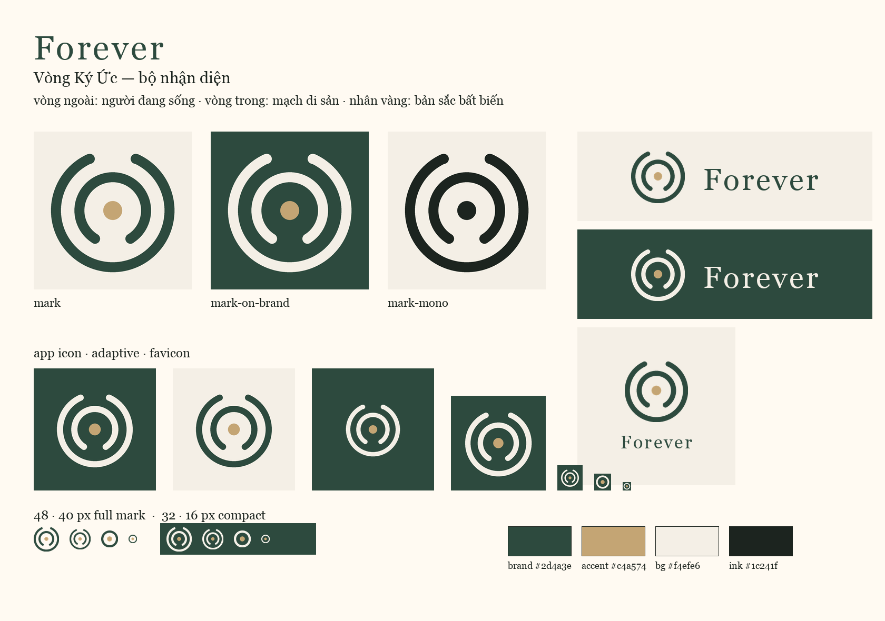

# Forever — Brand Logo Kit

> **Vòng Ký Ức** (The Memory Rings) — vòng người đang sống · mạch di sản · nhân bất biến



## Concept

Hai vòng cung đồng tâm mở về hai hướng đối nhau, ôm lấy một nhân vàng.

| Element | Meaning |
|---------|---------|
| Vòng ngoài (hở phía trên) | Người đang sống — mái nhà bảo vệ, còn chừa chỗ cho thế hệ sau bước vào |
| Vòng trong (hở phía dưới) | Mạch di sản — hướng về cội nguồn, đối thoại từ phía bên kia |
| Nhân vàng | Bản sắc bất biến — Identity Lock |

Đọc được theo bốn lớp, tất cả đều đúng với sản phẩm: **mặt số két sắt** (két sắt ký ức gia tộc) · **vòng năm của cây** (cội nguồn) · **sóng giọng nói lan từ tâm** (Voice DNA) · **hai vòng tay ôm** (gia đình).

Không phải mạng xã hội. Không phải quyển sách — tách biệt hoàn toàn với sản phẩm Read. Không phải nghĩa trang số.

**Vì sao không dùng ∞:** bộ mark cũ (`The Living Loop`) đặt lemniscate trong vòng tròn — cách diễn đạt "forever" hiển nhiên nhất, đã quá phổ biến, và ở kích thước nhỏ hai thùy ∞ dính vào nhau. Vòng Ký Ức giữ lại vòng bảo vệ và nhân vàng, bỏ ∞.

**Vì sao nhân vàng nhỏ:** nhân to hơn biến hai vòng đồng tâm thành **con mắt / khẩu độ ống kính** — tín hiệu "bị theo dõi", sai hoàn toàn với một sản phẩm lấy riêng tư làm gốc.

## Palette

Khớp `apps/mobile/lib/theme.ts`:

| Token | Hex | Use |
|-------|-----|-----|
| `brand` | `#2d4a3e` | Nét chính trên nền sáng, nền icon/splash |
| `accent` | `#c4a574` | Nhân vàng, tagline |
| `bg` | `#f4efe6` | Nền sáng, nét mark trên nền tối |
| `ink` | `#1c241f` | Bản mono / in ấn |

Nhân **luôn** là accent gold, trừ bản mono (một màu duy nhất).

## Typography

- **Wordmark:** Georgia — chính là `fonts.display` của app, nên wordmark khớp tuyệt đối với heading trong UI.
- Tracking: ~0.07em (lockup ngang) → 0.10em (lockup dọc, splash).
- Tagline: *Két sắt ký ức gia tộc* · Subline: *Mái nhà số cho gia đình — kết nối, lưu giữ, trường tồn.*

## Files

```
brand/logo/
  specimen.png  bảng tổng quan cả hệ thống
  svg/          mark, wordmark, lockup (vector)
  png/          mark/wordmark 1024px, lockup
  app/          icon, adaptive FG, splash, favicon (+ .ico), OG banner
apps/mobile/assets/
  icon.png              Expo app icon (nền brand)
  adaptive-icon.png     Android adaptive foreground
  splash.png            Launch screen
  logo-mark.png         Mark trong suốt, nét cream — dùng trên nền tối
  logo-mark-brand.png   Mark trong suốt, nét brand — dùng trên nền sáng
  favicon.png           Expo web
apps/api/static/brand/  Favicon + OG do API phục vụ (/favicon.ico, /brand/*)
```

### Key assets

| Asset | Path |
|-------|------|
| Mark (trong suốt) | `svg/mark.svg`, `png/mark.png` |
| Mark trên nền tối | `svg/mark-on-dark.svg`, `png/mark-on-dark.png` |
| Mark có nền | `png/mark-on-brand.png`, `png/mark-on-cream.png` |
| Mark compact (≤32px) | `svg/mark-compact.svg`, `png/mark-compact.png` |
| Mono / mono đảo | `svg/mark-mono.svg`, `svg/mark-mono-reversed.svg` |
| Wordmark | `{svg,png}/wordmark{,-reversed,-on-cream,-on-dark}` (`-reversed` = nét cream, nền trong suốt) |
| Lockup ngang | `{svg,png}/lockup-horizontal{,-on-cream,-on-dark}` |
| Lockup dọc | `{svg,png}/lockup-stacked{,-on-cream,-on-dark}` |
| App icon | `app/icon.png` (+ `icon-light.png` cho nền cream) |
| Adaptive FG | `app/adaptive-icon.png` |
| Splash | `app/splash.png` |
| Favicon | `app/favicon-{16,32,48,180,192,512}.png`, `app/favicon.ico` |
| OG / social | `app/og-banner.png` |

### In-app usage

- `apps/mobile/components/BrandLogo.tsx` — mark + wordmark, đọc `logo-mark.png` / `logo-mark-brand.png`.
- Login hero: lockup dọc trên nền brand green.
- Header: lockup ngang trên nền cream.

### API / docs

Chưa có web frontend riêng, nên API phục vụ luôn asset thương hiệu cho docs và share preview:

| URL | Asset |
|-----|-------|
| `GET /favicon.ico` | ICO đa kích thước (16/32/48/64) |
| `GET /brand/og-banner.png` | Open Graph banner |
| `GET /brand/*` | Các file đã sync (`icon.png`, PNG favicon, …) |

Swagger UI dùng `/favicon.ico` khi file tồn tại.

## Clear space & sizing

- Clear space ≥ ¼ đường kính mark ở cả bốn phía.
- Mark đầy đủ (hai vòng + nhân) dùng từ **40px** trở lên.
- Dưới 40px dùng `mark-compact` (một vòng kín + nhân, nét đậm hơn) — favicon 16/32 đã tự động dùng bản này.
- Nhân vàng không đổi màu trên lockup chính; chỉ bản mono cho phép nhân một màu với nét.
- Không kéo méo; scale đều. Không thêm viền, đổ bóng, gradient.
- Không đặt mark lên ảnh nhiều chi tiết mà thiếu lớp scrim đặc.
- Lockup vector dùng font hệ thống (Georgia). Trước khi gửi nhà in không có font này, convert text sang outline.

## Regenerate

```bash
python3 -m pip install pillow
python3 scripts/generate-brand-kit.py
```

Hình học của mark được định nghĩa **một lần** trong `Mark` (hộp 128×128) rồi xuất ra cả SVG và PNG, nên vector và raster không thể lệch nhau. Script ghi lại `brand/logo/{svg,png,app}`, đồng bộ `apps/mobile/assets/` và `apps/api/static/brand/`.

Bản nháp concept (không commit) đặt ở `brand/.explore/` — đã có trong `.gitignore`.
